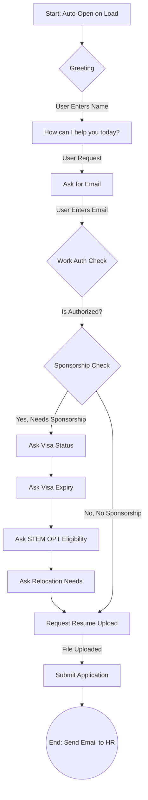

# DPR Solutions Recruiting Chatbot

A modern, AI-driven recruiting assistant integrated into the DPR Solutions corporate website. This chatbot helps streamlin the initial candidate screening process by collecting applicant details, verifying work authorization, and accepting resume uploads.

## 🚀 Features

-   **Interactive Chat Interface**: A polished, floating chat widget with smooth animations (Framer Motion).
-   **Automated Screening Flow**: Logic-driven conversation to gather candidate information.
-   **Smart Conditional Logic**: Dynamically adjusts questions based on user answers (e.g., asking about Visa details only if sponsorship is needed).
-   **File Upload**: Supports resume uploads (PDF, DOCX) directly within the chat.
-   **Email Integration**: Sends ample candidate profiles and resume details to HR via **EmailJS**.
-   **Responsive Design**: optimized for both desktop and mobile devices.

## 🛠️ Tech Stack

-   **Frontend**: React (Vite), TypeScript
-   **Styling**: Tailwind CSS v4, Lucide React (Icons)
-   **Animations**: Framer Motion
-   **Email Service**: EmailJS (@emailjs/browser)

## 🤖 Chatbot Workflow

The chatbot follows a structured decision tree to qualify candidates before submission.



## 📦 Setup & Installation

1.  **Clone the repository**
    ```bash
    git clone https://github.com/hputta23/Testsitebot.git
    cd Testsitebot
    ```

2.  **Install Dependencies**
    ```bash
    npm install
    ```

3.  **Run Development Server**
    ```bash
    npm run dev
    ```

4.  **Configure EmailJS**
    -   Create an account at [EmailJS.com](https://www.emailjs.com/).
    -   Create a Service (e.g., Gmail) and a Template.
    -   Update `src/utils/emailService.ts` with your keys:
        ```typescript
        const SERVICE_ID = 'YOUR_SERVICE_ID';
        const TEMPLATE_ID = 'YOUR_TEMPLATE_ID';
        const PUBLIC_KEY = 'YOUR_PUBLIC_KEY';
        ```

## 📂 Project Structure

-   `src/components/chat/`: Contains the ChatWidget, ChatInput, and ChatMessage components.
-   `src/utils/emailService.ts`: Handles the API communication with EmailJS.
-   `src/App.tsx`: Main application entry point.

---
*Built for DPR Solutions by Gemini Antigravity*
